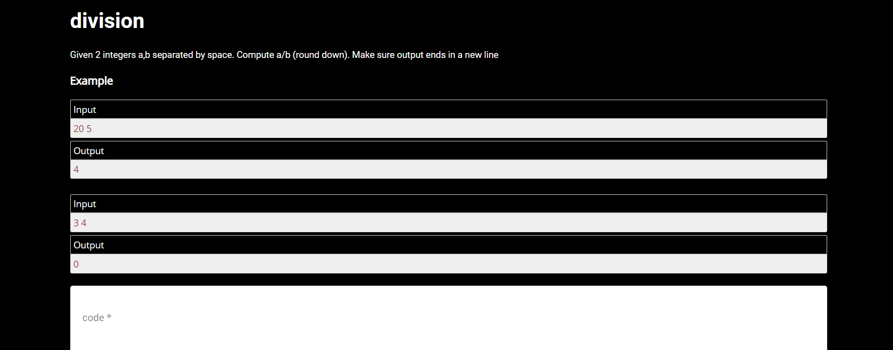
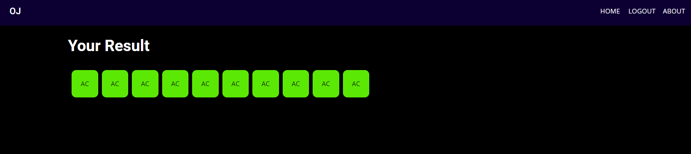

# Infinity Judge

## ⚡ About The Project

An open-source online judge for algorithmic coding problems.
Check it out [here](https://judge.rohanj.dev/)

### Built With

- React
- Docker
- Firebase/Firestore

### Features

- Isolated sandboxes to protect from malicious code
- Firebase authentication (Google auth coming soon)

### In Action





## 💻 Getting Started

### Prerequisites

1. Node16
2. [Isolate](https://github.com/ioi/isolate)

### Installation

1. Clone the repo
   ```sh
   git clone https://github.com/rjawesome/judge.git
   ```
2. Install NPM packages

   ```sh
   npm install
   cd server
   npm install

   cd ..

   cd client
   npm install
   ```

## 🚀 Usage

# Server:

```sh
cd server
docker build . --tag [name]
./server/run.sh [name] #api runs on port 10000
```

# Client:

1. edit client/.env with the api url
   ```
   REACT_APP_SERVER_URL = http://localhost:10000/
   ```

3. build client to html (serve files in client/build folder)
   ```sh
   cd client
   npm run build
   ```

## 🔥 Coming Soon

- More language support (Java, Python2, C)
- More problems
- Google Authentication
- Search functionality

## 📢 License

[Mozilla Public License](https://github.com/rjawesome/judge/blob/master/LICENSE)

## 💯 Creators

- Rishi Peddakama
- Rohan Juneja
